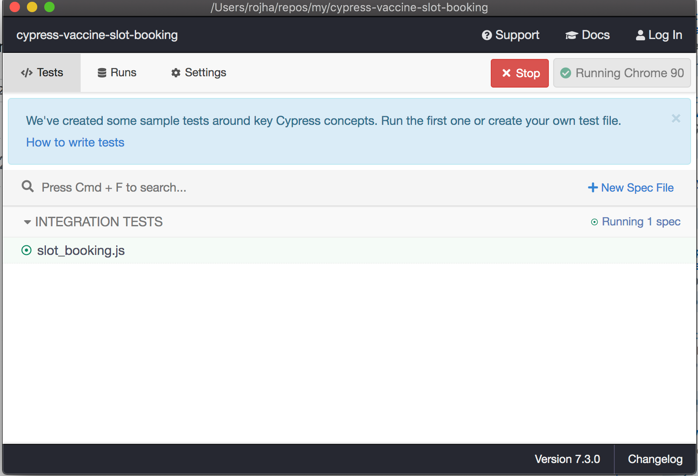
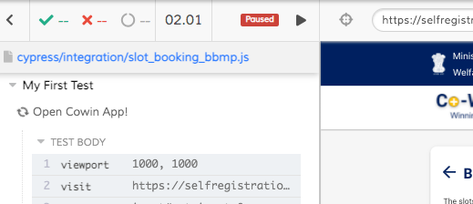

# Vaccine Slot Booking Using Cypress

## >>>Important: Please Read this<<<<
* This is a proof of concept project. I do NOT endorse or condone, in any shape or form, automating any monitoring/booking tasks. Use at your own risk.
* This CANNOT book slots automatically. It doesn't skip any of the steps that a normal user would have to take on the official portal. You will still have to enter the `OTP` and `Captcha`.
* This works only for existing users.
* And finally, code quality is not so good at the moment, even selectors are very specific, and might stop working on next `cowin` app release. Its just a POC and can be improved.

### Install (`Node should be available in your system >= 10.x.x`)
```
git clone https://github.com/rojha-mdsol/cypress-vaccine-slot-booking.git
cd cypress-vaccine-slot-booking
npm i
```

### Steps to run this
1. Update `cypress.env.json` with your phone number, state and district `(NOTE: State and District name has to be exact as it comes in cowin app)`

2. In Terminal enter the below command

    ```
    npm run cy:open
    ```
3. Cypress Panel will open with something like this:

    

4. Click on `slot_booking_bbmp.js` in cypress panel.

5. Then A new instance of chrome will be opened, enter OTP when it asks for it.

6. Click on `Verify Otp` button

7. Select a `beneficiary`

8. Click on `play`, you can find something like this on top of the opened chrome.
    
    

9. Wait and Watch :)

### Things to consider.

* If it finds any available slot, the page will go to next screen where you will have to select a slot and enter `captcha` and then `confirm`.
* After almost 15 mins the whole process will start again, so you will have to enter otp again and continue with rest of the steps.
