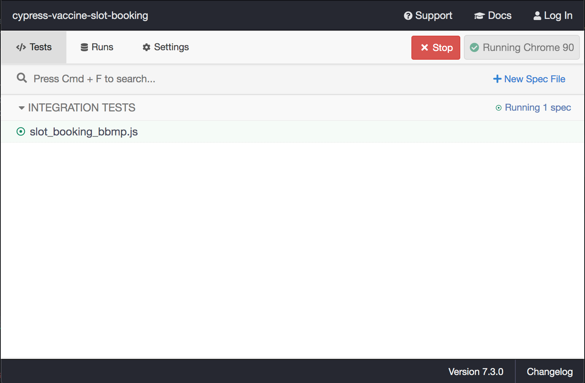

# Vaccine Slot Booking Using Cypress

## >>>Important: Please Read this<<<<
* This is a proof of concept project. I do NOT endorse or condone, in any shape or form, automating any monitoring/booking tasks. Use at your own risk.
* This CANNOT book slots automatically. It doesn't skip any of the steps that a normal user would have to take on the official portal. You will still have to enter the OTP and Captcha.
* For now this works only for `BBMP` district in `Karnataka`. But same logic can be used for any other district for any state and for any pincode
* After entering OTP, do not click on verify button, Just click on resume (need to fix this step -> WIP)
* This works only for existing users.
* Please update the mobile number, search for `<your_mobile_number>` in code base.
* And finally, code quality is not so good at the moment, even selectors are very specific, and might stop working on next `cowin` app release. Its just a POC and can be improved.

### Install
```
npm i
```

### Run
```
npm run cy:open
```

### Then click on `slot_booking.js` in opened cypress panel


### Here is the result

